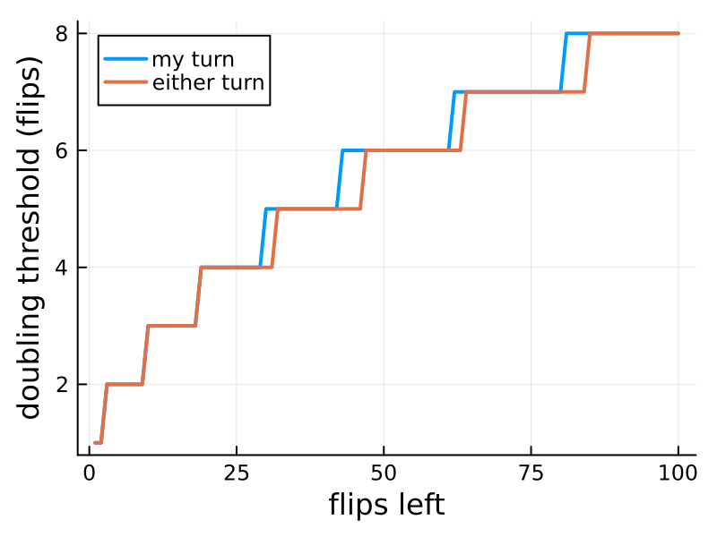
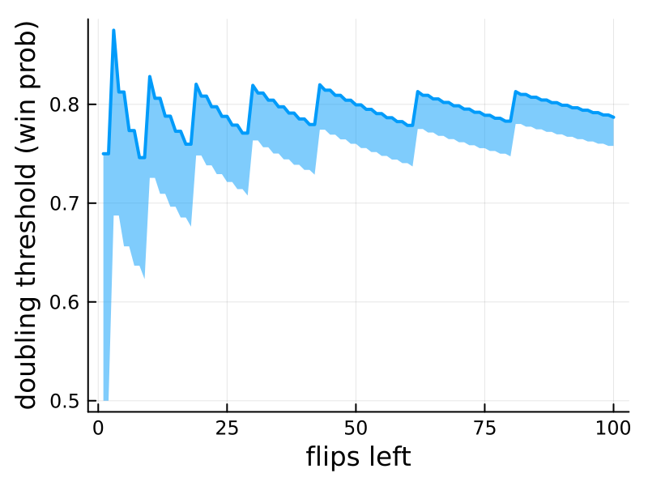

# Doubling simulations

This is a toy example to try to understand the optimal strategy for doubling in Backgammon. We use a simplified game model where you just flip a coin on every turn and the winner is the one with the most flips in their favor.

## Results

This is the mininum advantage you need (number of flips ahead) for it to be worth doubling, as a function of the number of flips left. An interesting thing here is that the threshold is sometimes one flip higher when its your turn---I think this is because by doubling you're giving up an advantage you have over your opponent. When either player can double (before anyone has doubled), there's no such advantage.

It's potentially more informative to express the threshold in terms of a win probability. There's a weird cyclic thing here which is likely due to the discrete nature of the model. The ribbon is showing the range of win proabibilities between the threshold and the next lowest score, the range of win probabilities that the model effectively doesn't distinguish between. This makes it seem that the threshold is somewhat sensitive to the number of remaining flips, but only in the beginning.

